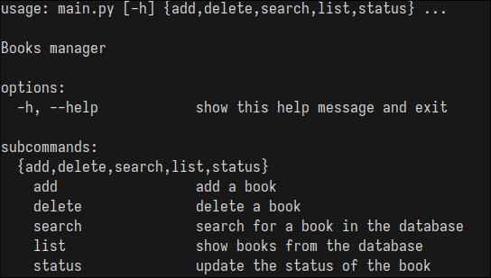

# Book Manager

> [!WARNING]
> Это моё решение тестового задания на позицию Junior Python-разработчика.

Программа для управления библиотекой книг. 

<p align=center>
  
</p>


## Использование
Посмотреть все доступные команды:
```console
$ python3 main.py -h
```

Добавить новую книгу:
```console
$ python3 main.py add TITLE AUTHOR YEAR
$ python3 main.py add 'Скотный двор' 'Джордж Оруэлл' 1945 
```

Удалить книгу:
```console
$ python3 main.py delete ID
$ python3 main.py delete 69420 
```

Отобразить все доступные книги:
```console
$ python3 main.py list
```

Поиск книг:
```console
$ python3 main.py search [-t TITLE] [-a AUTHOR] [-y YEAR] 
$ python3 main.py search -t 'Капитанская дочка'
$ python3 main.py search -a 'А. С. Пушкин' -y 1823
```

Изменить статус книги:
```console
$ python3 main.py status ID NEW_STATUS 
$ python3 main.py status 1191 'Выдана' 
```

###  Реализованный функционал:
- [x] Добавление книг
- [x] Удаление книг
- [x] Поиск книг
- [x] Отображение всех книг
- [x] Изменение статуса книги

### Дополнительные требования:
- [x] Аннотации
- [x] README.md
